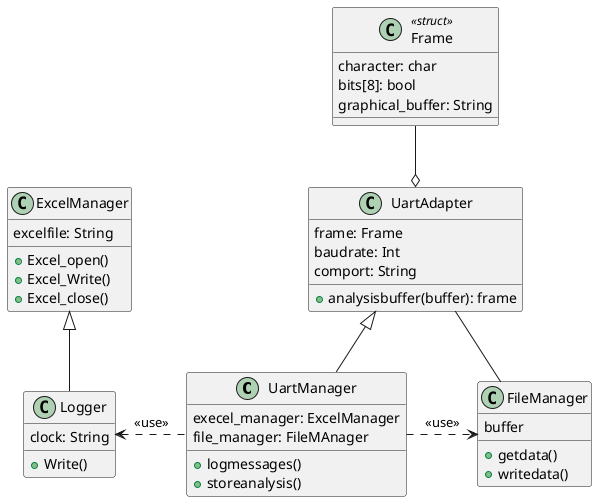

# Uart_debuger
## How to use it
- Make sure that you are inside the project folder before executing any of the following commands
- Build the debugger by executing the following command:

```shell
make gdb_uart
```

- Run the uart debugger 

```shell
./build/gdb_uart
```
----------------------------

## Design snippets


