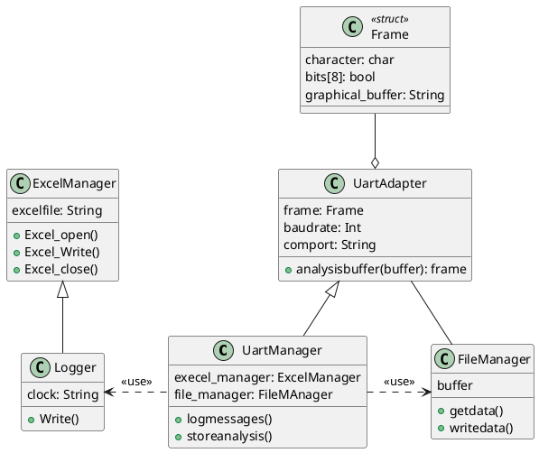

# Uart_debuger

<!-- TODO: An introduction about the project and its use-cases shall be written here. -->
## How to use it
### Prerequisites
- The current code was built using *gcc version 7.5.0*

### Build the debugger by executing the following command:

```shell
make gdb_uart
```

### Run the uart debugger 

```shell
./build/gdb_uart
```
----------------------------

## Design snippets



